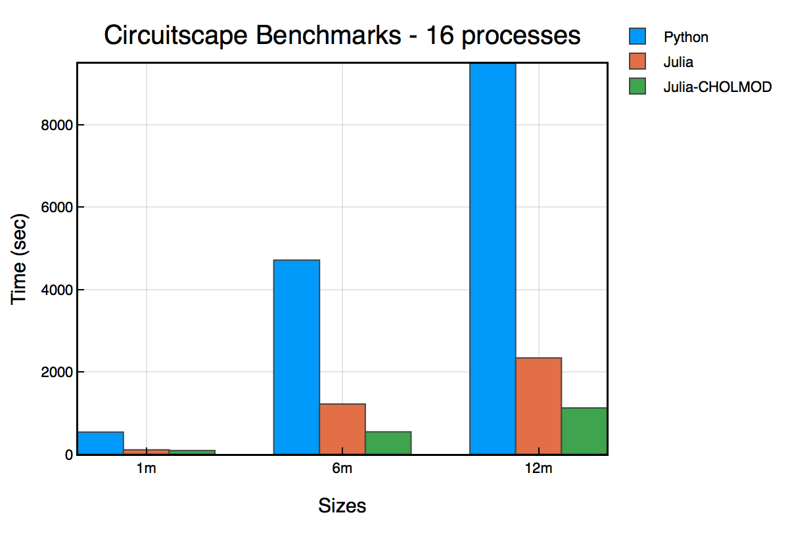

# Circuitscape Documentation

Circuitscape is an open-source Julia program that uses circuit theory to model connectivity 
in heterogeneous landscapes. Its most common applications include modeling movement and gene
flow of plants and animals, as well as identifying areas important for connectivity 
conservation. Circuit theory complements commonly-used connectivity models because of its 
connections to random walk theory and its ability to simultaneously evaluate contributions 
of multiple dispersal pathways. Landscapes are represented as conductive surfaces, with 
low resistances assigned to landscape features types that are most permeable to movement 
or best promote gene flow, and high resistances assigned to movement barriers. Effective 
resistances, current flow, and voltages calculated across the landscapes can then be 
related to ecological processes, such as individual movement and gene flow.

More detail about the underlying model, its parameterization, and potential applications 
in ecology, evolution, and conservation planning can be found in McRae (2006) and 
McRae et al. (2008).

More detail about implementation can be found in the
[Circuitscape In Julia paper](https://proceedings.juliacon.org/papers/10.21105/jcon.00058).

A [PDF version](assets/Circuitscape.jl.pdf) of this documentation is also available.

# Quick Start Guide

This is a quick start guide. If you're looking for basics on how to use Circuitscape,
refer to the usage guide.

To run Circuitscape, you need to install [Julia](https://julialang.org/downloads/).
At the Julia prompt, install the Circuitscape package by running the following code

```julia
using Pkg
Pkg.add("Circuitscape")
```

You can also install Circuitscape in a
[local project](https://julialang.github.io/Pkg.jl/v1/environments/) as well.

## Running a job

A Circuitscape job is fully described by an INI file. This configuration file consists of
file paths to data as well as flag values. A detailed list of all INI arguments can be
found in the [Inputs, Outputs and Options](options.md) section. Examples can be found in the
[test folder](https://github.com/Circuitscape/Circuitscape.jl/tree/master/test/input). You
can also use a built-in terminal UI to build Circuitscape jobs. For more on that, skip
ahead to Building a Circuitscape Job.

If you do have your INI file handy, you can run the job by:
```julia
using Circuitscape
compute("myjob.ini")
```

You can also run Circuitscape programmatically by passing a configuration dictionary:
```julia
using Circuitscape
cfg = Circuitscape.init_config()
cfg["habitat_file"] = "resistance_map.asc"
cfg["point_file"] = "focal_nodes.asc"
cfg["scenario"] = "pairwise"
cfg["output_file"] = "output/results.out"
compute(cfg)
```

## Building a Circuitscape Job


The builder is kicked off by calling the `start()` function from the Julia prompt. It will
build an INI file for you step by step, and either run the job directly or write the
final INI file to a specified location. You can exit the builder at any time by hitting
Ctrl+C.

Please note that this version of Circuitscape **does not** come with a GUI.

You can also manually write your own INI file by copying and pasting an example
from the [test folder](https://github.com/Circuitscape/Circuitscape.jl/tree/master/test/input) and changing values as needed.

## Citing Circuitscape

Please use the following to cite Circuitscape: 

```bibtex
@article{Anantharaman2020,
  doi = {10.21105/jcon.00058},
  url = {https://doi.org/10.21105/jcon.00058},
  year = {2020},
  publisher = {The Open Journal},
  volume = {1},
  number = {1},
  pages = {58},
  author = {Ranjan Anantharaman and Kimberly Hall and Viral B. Shah and Alan Edelman},
  title = {Circuitscape in Julia: High Performance Connectivity Modelling to Support Conservation Decisions},
  journal = {Proceedings of the JuliaCon Conferences}
}
```

## Circuitscape.jl vs Circuitscape 4 (Python)

Circuitscape.jl is built entirely in the Julia language, offering significant
performance advantages over the previous Python version (v4.0.5).

### Faster and More Scalable

We benchmarked `Circuitscape.jl` with the Python version (v4.0.5) using
16 parallel processes and benchmark problems from the standard Circuitscape
[benchmark suite.](https://github.com/Circuitscape/BigTests)

```@raw html

```

These benchmarks were run on a Linux (Ubuntu) server machine with the following specs:
* Name: Intel(R) Xeon(R) Silver 4114 CPU
* Clock Speed: 2.20GHz
* Number of cores: 20
* RAM: 384 GB

From the benchmark, Circuitscape.jl is up to *4x faster*
on 16 processes. However, the best performing bar in the chart is
_Julia-CHOLMOD_, which uses a direct solver.

### CHOLMOD Solver

The CHOLMOD solver performs a [Cholesky
decomposition](https://en.wikipedia.org/wiki/Cholesky_decomposition) on the graph
constructed, and performs a batched back substitution
to compute the voltages. It plugs into the
[CHOLMOD](http://faculty.cse.tamu.edu/davis/suitesparse.html) library,
which is part of the SuiteSparse collection of high performance sparse
matrix algorithms.

To use this mode, include a line in your Circuitscape
INI file:
```
solver = cholmod
```

The Cholesky decomposition is a direct solver method, unlike the algebraic
multigrid method used by default.
The advantage is that it can be much faster than
the iterative solution for smaller problem sizes.

*Word of caution*: The Cholesky decomposition is not practical
to use beyond a certain problem size because of a phenomenon called
[fill-in](https://algowiki-project.org/en/Cholesky_method#Reordering_to_reduce_the_number_of_fill-in_elements), which results in loss of sparsity and large memory consumption.

### Parallel on All Platforms

Circuitscape.jl natively supports parallelism on Linux, macOS, and Windows.

### Single Precision (Experimental)

Circuitscape.jl supports running problems in
single precision as opposed to the standard double precision.

Single precision usually takes much less memory, but trades off
against solution accuracy.

Use this new feature by including a line in your config file:
```
precision = single
```

# Related Projects

1. [Omniscape.jl](https://github.com/Circuitscape/Omniscape.jl) - Omnidirectional connectivity analysis built on top of Circuitscape
2. [AlgebraicMultigrid.jl](https://github.com/JuliaLinearAlgebra/AlgebraicMultigrid.jl) - Algebraic Multigrid methods in Julia. This is the default solver used in Circuitscape. 

# Further Reading

* Beier, P., W. Spencer, R. Baldwin, and B.H. McRae. 2011\. Best science practices for developing regional connectivity maps. Conservation Biology 25(5): 879-892

* Dickson B.G., G.W. Roemer, B.H. McRae, and J.M. Rundall. 2013\. Models of regional habitat quality and connectivity for pumas (_Puma concolor_) in the southwestern United States. PLoS ONE 8(12): e81898\. doi:10.1371/journal.pone.0081898

* McRae, B.H. 2006\. Isolation by resistance. Evolution 60:1551-1561.

* McRae, B.H. and P. Beier. 2007\. Circuit theory predicts Gene flow in plant and animal populations. Proceedings of the National Academy of Sciences of the USA 104:19885-19890.

* McRae, B.H., B.G. Dickson, T.H. Keitt, and V.B. Shah. 2008\. Using circuit theory to model connectivity in ecology and conservation. Ecology 10: 2712-2724.

* Shah, V.B. 2007\. An Interactive System for Combinatorial Scientific Computing with an Emphasis on Programmer Productivity. PhD thesis, University of California, Santa Barbara.

* Shah,V.B. and B.H. McRae. 2008\. Circuitscape: a tool for landscape ecology. In: G. Varoquaux, T. Vaught, J. Millman (Eds.). Proceedings of the 7th Python in Science Conference (SciPy 2008), pp. 62-66.

* Spear, S.F., N. Balkenhol, M.-J. Fortin, B.H. McRae and K. Scribner. 2010\. Use of resistance surfaces for landscape genetic studies: Considerations of parameterization and analysis. Molecular Ecology 19(17): 3576-3591.

* Zeller K.A., McGarigal K., and Whiteley A.R. 2012\. Estimating landscape resistance to movement: a review. Landscape Ecology 27: 777-797.

