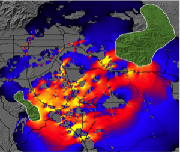
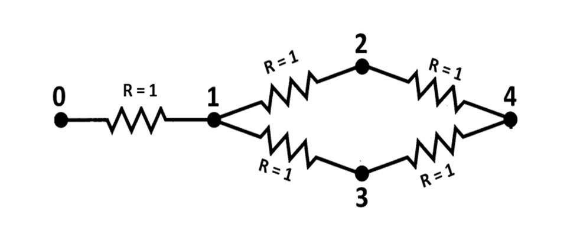
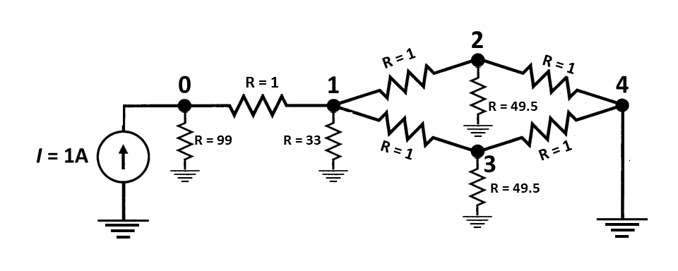

# Options and Flags

## INI Argument Reference

All Circuitscape configuration is done through an `.ini` file. Below is a complete reference of all arguments, organized by section, with their types, default values, and descriptions.

### Circuitscape Mode

| Argument | Type | Default | Description |
|----------|------|---------|-------------|
| `data_type` | String | `raster` | Input data type. Values: `raster`, `network`. |
| `scenario` | String | `not entered` | Modeling mode. Values: `pairwise`, `advanced`, `one-to-all`, `all-to-one`. |

### Habitat Raster or Graph

| Argument | Type | Default | Description |
|----------|------|---------|-------------|
| `habitat_file` | Path | — | Path to the resistance/conductance map file (raster or network). |
| `habitat_map_is_resistances` | Boolean | `True` | If `True`, habitat map values are resistances. If `False`, values are conductances. |

### Connection Scheme for Raster Habitat Data

| Argument | Type | Default | Description |
|----------|------|---------|-------------|
| `connect_four_neighbors_only` | Boolean | `False` | If `True`, connect each cell to 4 cardinal neighbors only. If `False`, connect to all 8 neighbors. |
| `connect_using_avg_resistances` | Boolean | `False` | If `True`, use average resistance for cell connections. If `False`, use average conductance. |

### Short-Circuit Regions (Polygons)

| Argument | Type | Default | Description |
|----------|------|---------|-------------|
| `use_polygons` | Boolean | `False` | If `True`, read a short-circuit region file. Cells within each region are collapsed into a single node with zero resistance. |
| `polygon_file` | Path | — | Path to the short-circuit region map. Must have the same cell size and extent as the resistance grid. |

### Options for Advanced Mode

| Argument | Type | Default | Description |
|----------|------|---------|-------------|
| `source_file` | Path | — | Path to the current source file (raster or text list). Values specify source strength in amps. |
| `ground_file` | Path | — | Path to the ground point file (raster or text list). Values specify resistance or conductance to ground. |
| `ground_file_is_resistances` | Boolean | `True` | If `True`, ground file values are resistances. If `False`, conductances. Set to `False` with value 0 to connect directly to ground. |
| `use_unit_currents` | Boolean | `False` | If `True`, all current sources are set to 1 Amp regardless of values in the source file. |
| `use_direct_grounds` | Boolean | `False` | If `True`, all ground nodes are tied directly to ground (R=0) regardless of values in the ground file. |
| `remove_src_or_gnd` | String | `keepall` | When a source and ground are at the same node: `keepall`, `rmvsrc`, `rmvgnd`, or `rmvall`. |

### Options for Pairwise, One-to-All, and All-to-One Modes

| Argument | Type | Default | Description |
|----------|------|---------|-------------|
| `point_file` | Path | — | Path to focal node file (raster or text list). Each focal node must have a unique positive integer ID. |
| `use_included_pairs` | Boolean | `False` | If `True`, only run calculations on a subset of focal node pairs specified in the included pairs file. |
| `included_pairs_file` | Path | — | Path to file specifying pairs to include or exclude from calculations. |

### Options for One-to-All and All-to-One Modes

| Argument | Type | Default | Description |
|----------|------|---------|-------------|
| `use_variable_source_strengths` | Boolean | `False` | If `True`, read per-node source strengths from a file instead of using 1 Amp for all. |
| `variable_source_file` | Path | `None` | Path to text file with focal node IDs and corresponding source strengths. |

### Mask File

| Argument | Type | Default | Description |
|----------|------|---------|-------------|
| `use_mask` | Boolean | `False` | If `True`, apply a mask to the resistance map. Cells with negative, zero, or NODATA values in the mask are dropped. |
| `mask_file` | Path | `None` | Path to the raster mask file. |

### Output Options

| Argument | Type | Default | Description |
|----------|------|---------|-------------|
| `output_file` | Path | — | Base path and filename for all output files. |
| `write_cur_maps` | Boolean | `False` | If `True`, write current maps for each iteration and a cumulative map. |
| `write_volt_maps` | Boolean | `False` | If `True`, write voltage maps for each iteration. |
| `write_cum_cur_map_only` | Boolean | `False` | If `True`, calculate current maps for each iteration but only write the cumulative (summed) map to disk. |
| `write_max_cur_maps` | Boolean | `False` | If `True`, write a map showing the maximum current value at each cell across all iterations. |
| `set_null_currents_to_nodata` | Boolean | `False` | If `True`, set cells with zero current to NODATA in output current maps. |
| `set_null_voltages_to_nodata` | Boolean | `False` | If `True`, set cells with zero voltage to NODATA in output voltage maps. |
| `set_focal_node_currents_to_zero` | Boolean | `False` | If `True`, set current at focal nodes to zero in output maps. *Note: not yet implemented in Circuitscape 5.* |
| `compress_grids` | Boolean | `False` | If `True`, compress output ASCII grids using gzip. |
| `log_transform_maps` | Boolean | `False` | If `True`, log10-transform values in output current maps. Cells with zero current are set to NODATA. |
| `write_as_tif` | Boolean | `False` | If `True`, write output rasters as GeoTIFF instead of ASCII grid format. |

### Calculation Options

| Argument | Type | Default | Description |
|----------|------|---------|-------------|
| `solver` | String | `cg+amg` | Linear solver to use. Values: `cg+amg` (iterative, recommended for large grids), `cholmod` (direct, uses more memory), `pardiso` (direct, requires [Pardiso.jl](https://github.com/JuliaSparse/Pardiso.jl)). |
| `precision` | String | `Double` | Floating-point precision. Values: `Double`, `Single`. CHOLMOD and Pardiso require double precision. |
| `use_64bit_indexing` | Boolean | `True` | If `True`, use 64-bit integer indexing. Required for very large grids. |
| `cholmod_batch_size` | Integer | `1000` | Number of pairs to solve simultaneously when using CHOLMOD in pairwise mode. |
| `parallelize` | Boolean | `False` | If `True`, run iterations in parallel. |
| `max_parallel` | Integer | `0` | Number of parallel workers to use. |
| `low_memory_mode` | Boolean | `False` | If `True`, reduce memory usage at the cost of computation time. |
| `preemptive_memory_release` | Boolean | `False` | If `True`, release memory more aggressively during computation. |

### Reclassification

| Argument | Type | Default | Description |
|----------|------|---------|-------------|
| `use_reclass_table` | Boolean | `False` | If `True`, reclassify resistance values using a lookup table. *Note: not yet implemented in Circuitscape 5.* |
| `reclass_file` | Path | — | Path to file with reclassification data. |

### Logging

| Argument | Type | Default | Description |
|----------|------|---------|-------------|
| `log_file` | Path | `None` | Path to log file. If `None`, no file logging. |
| `log_level` | String | `INFO` | Logging level. Values: `DEBUG`, `INFO`, `WARNING`, `CRITICAL`. |
| `screenprint_log` | Boolean | `False` | If `True`, print log messages to the screen. |
| `print_timings` | Boolean | `False` | If `True`, print timing information for each solve. |
| `print_rusages` | Boolean | `False` | If `True`, print resource usage statistics. |
| `suppress_messages` | Boolean | `False` | If `True`, suppress all informational messages. |
| `profiler_log_file` | Path | `None` | Path to profiler log file. |

---

## Data Type

Set `data_type` to `raster` or `network` to choose whether you will be analyzing raster grid or network data.

## Modeling Mode

Circuitscape is run in one of four modes (set via `scenario`). Pairwise and advanced modes are available for both raster and network data types. The one-to-all and all-to-one modes are available for raster data only.

## Resistance Map or Network/Graph

The resistance file (`habitat_file`) specifies the ability of each cell in a landscape or link in a network to carry current. File formats are described in the _Input file formats_ section below.

Most users code their data in terms of resistances (with higher values denoting greater resistance to movement). Set `habitat_map_is_resistances = False` to specify conductances instead (conductance is the reciprocal of resistance; higher values indicate greater ease of movement).

Zero and infinite values for conductances and resistances represent special cases. Infinite resistances are coded as NODATA values in input resistance grids, or as zero or NODATA in input conductance grids; these are treated as complete barriers and are disconnected from all other cells. For raster analyses, cells with zero resistance (infinite conductance) can be specified using a separate short-circuit region file as described below.

## Focal Nodes (Pairwise, One-to-All, and All-to-One Modes)

The focal node file (`point_file`) specifies locations of nodes between which effective resistance and current flow are to be calculated. **Each focal node should have a unique positive integer ID.** Files may be text lists specifying coordinates or raster grids. When a grid is used, it must have the same cell size and extent as the resistance grid. Cells that do not contain focal nodes should be coded with NODATA values.

For raster analyses, focal nodes may occur at points (single cells on the resistance grid) or across regions. For the latter, a single ID would occupy more than one cell in a grid or more than one pair of coordinates in a text list (and falling within more than one cell in the underlying resistance grid). Cells within a single region are collapsed into a single node. The difference from short-circuit regions is that a focal region will be "burned in" to the resistance grid only for pairwise calculations that include that focal node. Focal regions need not be contiguous. For large grids, focal regions may require more computation time. When calculating resistances on large raster grids and not creating voltage or current maps, focal points will run much more quickly.

### Parallelism

Circuitscape can run iterations in parallel for pairwise mode when focal points (not focal regions) are used. Set `parallelize = True` and `max_parallel` to the desired number of processes.

## Advanced Mode Options

### Current Source File

The source file (`source_file`) specifies locations and strengths, in amps, of current sources. Either a raster or a text list may be used. Rasters must have the same cell size, projection, and extent as the resistance grid, and cells that do not contain current sources should be coded with NODATA values. Current sources may be positive or negative (i.e., they may inject current into the grid or pull current out). Similarly, grounds may either serve as a sink for current or may contribute current if there are negative current sources in the grid.

### Ground Point File

The ground file (`ground_file`) specifies locations of ground nodes and resistances or conductances of resistors tying them to ground. Either a raster or a text list may be used. Rasters must have the same cell size, projection, and extent as the resistance grid, and cells that do not contain grounds should be coded with NODATA values. If a direct (R = 0) ground connection conflicts with a current source, the ground will be removed unless `remove_src_or_gnd` is set to `rmvgnd` or `keepall`.

Set `ground_file_is_resistances = False` if your ground point file specifies connections to ground in terms of conductance instead. To tie cells directly to ground, keep `ground_file_is_resistances = True` and set values in the ground point file to zero.

### Unit Currents and Direct Grounds

Set `use_unit_currents = True` to force all current sources to 1 Amp, regardless of the value specified in the source file. Set `use_direct_grounds = True` to tie all ground nodes directly to ground (R=0) regardless of the ground file values.

### Source/Ground Conflicts

When a cell is connected both to a current source and to ground, `remove_src_or_gnd` determines the behavior: `keepall` (default), `rmvsrc`, `rmvgnd`, or `rmvall`. When using `keepall`, if a source is tied directly to ground (zero resistance), the ground connection will be removed.

## Output Options

### Current Maps

When `write_cur_maps = True`, current maps will be generated for every pair of focal nodes in pairwise mode, or for the source/ground configuration in advanced mode. Current maps have the same dimension as the input files, with values at each cell representing the amount of current flowing through the node. In pairwise mode, a current map file will be created for each focal node pair, and a cumulative (additive) map will also be written. (Note that for a given pair of focal nodes, current maps are identical regardless of which node is the source and which is the ground due to symmetry.) For advanced mode, a single map will be written. Such maps can be used to identify areas which contribute most to connectivity between focal points (McRae et al. 2008).

**Fig. 1.** Current map used to predict important connectivity areas between core habitat patches (green polygons, entered as focal regions) for mountain lions. Warmer colors indicate areas with higher current density. "Pinch points," or areas where connectivity is most tenuous, are shown in yellow. Research Collaborators: Brett Dickson and Rick Hopkins, Live Oak Associates.

### Voltage Maps

When `write_volt_maps = True`, voltage maps are written. In pairwise mode, these give node voltages observed for each focal node pair if one node were connected to a 1 amp current source and the other to ground. In advanced mode, voltage maps show voltages resulting from the source and ground configurations.

## Calculation Options

### Cell Connectivity

For raster operations, Circuitscape creates a graph by connecting cells to their neighbors. Set `connect_four_neighbors_only = True` for 4 cardinal neighbors only (default is 8, including diagonals).

### Average Resistance vs Conductance

Set `connect_using_avg_resistances = True` to connect cells by their average resistance instead of average conductance (the default).

The distinction is particularly important when connecting cells with zero or infinite values. When average resistances are used, first-order neighbors are connected by resistors with resistance: _Rab_ = (_Ra_ + _Rb_) / 2, and second-order (diagonal) neighbors by: _Rab_ = sqrt(2) * (_Ra_ + _Rb_) / 2. When average conductances are used, first-order neighbors are connected by: _Gab_ = (_Ga_ + _Gb_) / 2, and second-order (diagonal) neighbors by: _Gab_ = (_Ga_ + _Gb_) / (2 * sqrt(2)).

## Mapping Options

### Maximum Current Maps

In pairwise, one-to-all, and all-to-one modes, current maps are created for every iteration. By default, Circuitscape writes a cumulative map showing the sum of values at each node or grid cell across all iterations. Set `write_max_cur_maps = True` to also write a map showing the maximum current value at each cell across iterations.

### Cumulative Maps Only

Set `write_cum_cur_map_only = True` to calculate current maps for each iteration but only write the cumulative (and optionally maximum) map to disk. This saves disk space when many iterations are performed.

### Compress Output Grids

Set `compress_grids = True` to compress output ASCII grids using gzip. This can be useful when many large maps will be written.

### Log-Transform Current Maps

Set `log_transform_maps = True` to apply a log10 transform to current densities in output maps. Cells with zero current will be set to NODATA values.

### Set Focal Node Currents to Zero

When `set_focal_node_currents_to_zero = True`, focal nodes will have zero current in output maps when they are activated. For pairwise mode, cumulative maps will still show currents flowing through focal regions from other pairs being activated. This helps show the importance of each focal region for connecting others (see Dickson et al. 2013). *Note: not yet implemented in Circuitscape 5.*

## Optional Input Files

### Mask File

Set `use_mask = True` and provide `mask_file` to apply a raster mask. Cells with negative, zero, or NODATA values in the mask will be dropped from the resistance map (treated as complete barriers). Positive integer cells will be retained. File should only contain integers and be in raster format.

### Short-Circuit Region Map

Set `use_polygons = True` and provide `polygon_file` to load short-circuit regions. These act as areas of zero resistance, providing patches through which current gets a "free ride." Each region should have a unique positive integer identifier; cells within each region are merged into a single node, including non-adjacent cells (regions need not be contiguous). Non-region areas should be stored as NODATA values. The file must have the same cell size and extent as the resistance grid.

### Variable Source Strengths

In one-to-all and all-to-one modes, set `use_variable_source_strengths = True` and provide `variable_source_file` with focal node IDs and corresponding source strengths. The file should be a text list with two columns (ID followed by source strength). All nodes not in the list will default to 1 Amp.

### Include/Exclude Focal Node Pairs

Set `use_included_pairs = True` and provide `included_pairs_file` to restrict calculations to a subset of focal node pairs. Users can either identify pairs to include or pairs to exclude, as specified in the first line of the file. This affects all modes except advanced mode. Files should be in tab-delimited text with a .txt extension.

## Input Raster Format

Raster input maps should be stored in Arc/Info ASCII grid or GeoTIFF format, as exported by standard GIS packages. Set `write_as_tif = True` to produce GeoTIFF output instead of ASCII grids. For focal nodes, the value stored in each grid location refers to the focal node ID, and a single ID can occupy more than one cell (IDs must be positive integers). For current sources, the grid value specifies the source strength in amps. For grounds, the grid value specifies either the resistance or conductance of the resistor tying each ground node to ground.

The ASCII raster format is as follows:

**Header:**

    ncols        <Number of columns>
    nrows        <Number of rows>
    xllcorner    <X coordinate of lower left corner>
    yllcorner    <Y coordinate of lower left corner>
    cellsize     <size of each cell>
    NODATA_value <Code for cells with no habitat, focal nodes, sources or grounds>

**Body (grid data):**

Numeric data only. Columns are delimited with tabs and rows are delimited with new line characters.

**Examples**

Below is a 10 x 10 resistance map. Cells with infinite resistance are assigned NODATA values (-9999):

    ncols         10
    nrows         10
    xllcorner     1
    yllcorner     1
    cellsize      1
    NODATA_value  -9999
    130    168    153    -9999  14     12    13     107    140    171
    104    3      2      -9999  13     158   12     14     13     114
    124    2      2      12     -9999  -9999 13     161    4      5
    184    5      4      14     13     14    -9999  13     4      4
    105    143    103    169    -9999  115   10     -9999  166    14
    187    1      163    188    121    142   14     175    -9999  10
    198    11     110    115    149    2     2      164    3      -9999
    100    11     193    14     12     4     2      1      11     13
    -9999  11     12     11     10     12    167    157    181    157
    -9999  -9999  122    134    12     157   192    184    190    172

Below is a 10 x 10 focal region map. Groups of cells have been coded as focal regions that will be treated as "core area polygons" to be connected in circuit analyses. All cells within each focal region will be collapsed into a single node (even the non-contiguous cell in region #1) when that region is activated in pairwise, one-to-all, or all-to-one analyses. This format is identical to the short-circuit region file format.

    ncols                10
    nrows                10
    xllcorner            1
    yllcorner            1
    cellsize             1
    NODATA_value -9999
    -9999  -9999  -9999  -9999  -9999  -9999  -9999  -9999  -9999  -9999
    -9999  1      1      -9999  -9999  -9999  -9999  -9999  -9999  -9999
    -9999  1      1      -9999  -9999  -9999  -9999  -9999  3      3
    -9999  1      1      -9999  -9999  -9999  -9999  -9999  3      3
    -9999  -9999  -9999  -9999  -9999  -9999  -9999  -9999  -9999  -9999
    -9999  1      -9999  -9999  -9999  -9999  -9999  -9999  -9999  -9999
    -9999  -9999  -9999  -9999   2      2     -9999  -9999  -9999  -9999
    -9999  -9999  -9999  -9999   2      2      2     -9999  -9999  -9999
    -9999  -9999  -9999  -9999  -9999  -9999  -9999  -9999  -9999  -9999
    -9999  -9999  -9999  -9999  -9999  -9999  -9999  -9999  -9999   -9999

Note that regions 1 and 2 are well-connected by a low-resistance corridor in the resistance map above. Region 3 is connected to the other two regions only if cells are connected to their eight neighbors. In the four-neighbor case, region 3 would be completely isolated.

## Text List File Format

For network/graph operations, resistor networks, focal nodes, current sources, and grounds should be stored as text lists (saved with a ".txt" extension). To specify a network of resistors, three columns are used. The first and second columns give the node IDs being connected by a resistor, and the third column gives the resistance value. For example, the simple circuit:

can be defined by the following text list:

        0    1    1
        1    2    1
        1    3    1
        2    4    1
        3    4    1

**Please note:** typically, there should just be one entry for each pair of connected nodes. If there are two entries for a single pair in the form of (node1, node2, value1) and (node2, node1, value2), these will be considered parallel resistors and their conductances will be summed. For example, if the above text list had an extra entry for node pair (4, 3) like this:

        0    1    1
        1    2    1
        1    3    1
        2    4    1
        3    4    1
        4    3    1

then the resistance between nodes 3 and 4 in the resulting graph would be 1/2 ohm.

For advanced mode, current sources and grounds are also stored as text lists. The above circuit can be expanded to include a current source and grounds with two extra input files. For example, we can add a 1 Amp current source at node 0 with a file that looks like this:

        0    1

To tie node 4 directly to ground (i.e. to connect it to ground with a wire that has a resistance of 0 Ohms) and connect the remaining nodes to ground with resistors, we can use a file that looks like this:

        0    99
        1    33
        2    49.5
        3    49.5
        4    0

The resulting circuit would look like this (from McRae et al. 2008):

For **raster** operations, you can also store focal nodes, current sources, and grounds as text lists (saved with a ".txt" extension). For each node referenced in a text list, a value and X and Y coordinates are specified as shown below.

        Value1 X1 Y1
        Value2 X2 Y2
        …

Note: X and Y are geographical coordinates, not row and column numbers.

Example text list (a partial list of the cell locations in the focal region map above; coordinates are for cell centroids):

        1    2.5    9.5
        1    3.5    9.5
        1    2.5    8.5
        1    3.5    8.5
        1    2.5    7.5
        1    3.5    7.5
        1    2.5    5.5
        2    6.5    4.5
        ...

For focal nodes, the value field references the focal node ID; values must be positive integers, and a single ID can occupy more than one pair of coordinates (and more than one cell in the underlying resistance grid). For current sources, the value field references the source strength in amps. For grounds, the value field references either the resistance or conductance of the resistor tying each ground node to ground.

## Include/Exclude File Format

This file is used when `use_included_pairs = True`, and affects all modes except advanced mode. There are two file formats that can be used. The first is the simplest, and gives a list of pairs to include in calculations, or pairs to exclude, as specified in the first line of the file. For example, if there are five focal nodes, numbered 1-5, and the following list is entered, only pairs (1,2), (1,3), and (1,5) will be analyzed:

    mode    include
    1        2
    1        3
    1        5

Similarly, if the first line in the above file read:

    mode     exclude

all pairs except (1,2), (1,3), and (1,5) would be analyzed.

The second method uses a matrix identifying which pairs of focal nodes to connect. The file specifies minimum and maximum values in the matrix to consider a pair connected. This method can be useful when used with a distance matrix to only run analyses between points separated by a minimum distance, or by a distance equal to or less than a maximum distance. Note: any focal node not in the matrix will be dropped from analyses. Entries on the diagonal are ignored. For example, in the following matrix, only pairs with entries between 2 and 50 are connected. Pairs (1,2), (2,4), and (3,4) will not be analyzed. Focal node 5 will be dropped entirely:

    min    2
    max    50
    0     1     2     3     4     5
    1     0     100   6.67  7     1
    2     100   0     11    1     60
    3     6.67  11    0     -1    100
    4     7     1     -1    0     0
    5     1     60     100  0     0

Make sure to include a zero in the upper-left corner of the matrix.

Files should be in tab-delimited text with a .txt extension.

## Output Files

### Current and Voltage Data

Current and voltage data for networks are written in text list formats. Raster voltage and current maps are written in ASCII raster format (or GeoTIFF if `write_as_tif = True`).

### Resistance Files

Resistance data are written in both matrix and 3-column formats.

Here are pairwise resistances written to the output directory for the eight neighbor case (using per-cell resistances and average resistances for cell connection calculations). The first row and column contain the focal node IDs:

      0          1            2            3
      1          0            11.93688471  15.03634473
      2          11.93688471  0            11.57640568
      3          15.03634473  11.57640568  0

Here are pairwise resistances written to the output directory for the four neighbor case, in which focal node 3 was completely isolated (-1 indicates infinite resistance):

      0          1            2            3
      1          0            33.55792693  -1
      2          33.55792693  0            -1
      3          -1           -1           0

For convenience, resistances are also written to a separate file in a 3-column format, e.g.:

      1      2       33.55792693
      1      3       -1
      2      3       -1
